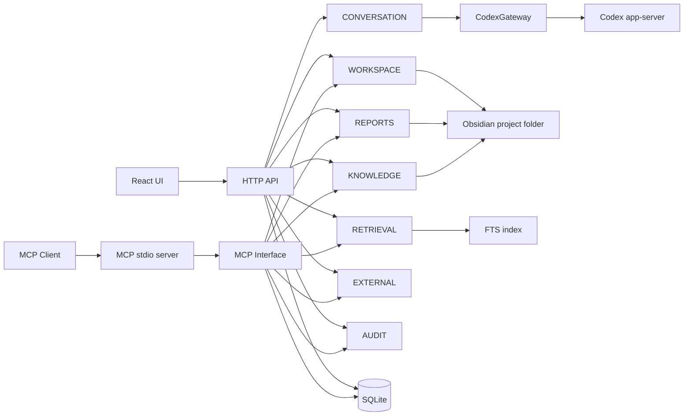

# Architecture Overview

## Runtime boundaries

- Vault files are canonical research assets.
- SQLite stores platform/application state.
- Retrieval index is derived and rebuildable.
- Codex integration is adapter-bound (`CodexGateway`).
- MCP ingress maps to existing app services and contains no domain logic.
