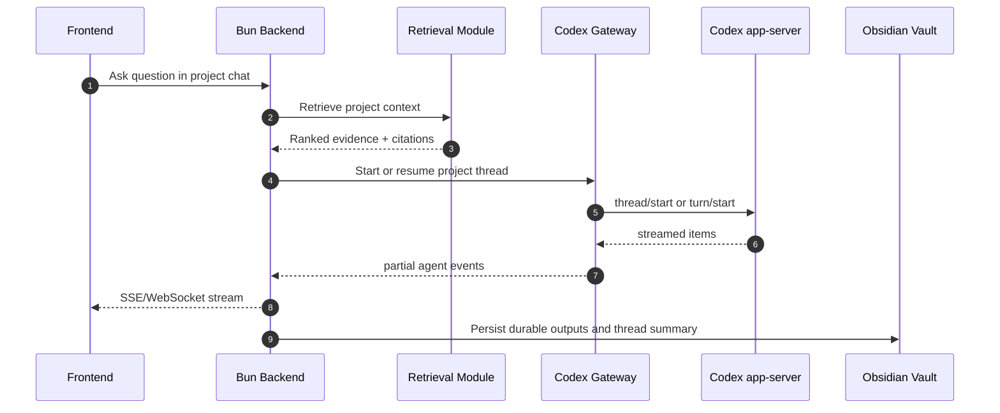

# Research Platform Plan

## 1. Purpose

Build a TypeScript research platform that lets a user keep evolving ideas with AI while grounding every conversation in the project's existing research materials.

Each research project is attached to exactly one Obsidian folder. That folder is the canonical knowledge space for the project. The platform should:

- let the user discuss a project with AI over time
- use prior notes, findings, reports, and syntheses as references
- let the user manually import externally-produced research reports (for example, a Deep Research report)
- generate a high-quality research query that can be sent to an external research tool to discover new concepts, sources, and references
- keep the system maintainable through a modulith architecture, domain-driven design, strong documentation, behaviour-driven integration tests, property-based tests, and composition-heavy implementation
- provide a UI-first workspace, with an optional MCP automation surface for power users and agent hosts

---

## 2. Product goals

### Primary goals

1. **Project-scoped research workspace**
   - Every project is mapped to one Obsidian folder.
   - The user can open a project and immediately work against its notes, reports, findings, and syntheses.

2. **Grounded AI discussion**
   - The AI must answer using project context first.
   - Responses should reference the current project's evidence base and carry traceable citations.

3. **Research evolution, not just chat**
   - The system should preserve discussions, extracted findings, synthesis notes, open questions, and imported reports.
   - The research corpus should become more useful after each interaction.

4. **External research loop**
   - The system should identify knowledge gaps.
   - It should produce a structured query package that can be sent to an external research tool.
   - Returned outputs can then be imported back into the same project.

### Non-goals for the first version

- Full multi-tenant collaboration
- Autonomous source scraping without explicit user intent
- Fully automatic knowledge graph construction
- Generic note-taking for non-research use cases
- Replacing Obsidian as the user's primary knowledge tool

---

## 3. Architectural principles

1. **Obsidian is canonical**
   - The project folder inside the Obsidian vault is the source of truth for research content.
   - Derived indexes, caches, and search models are rebuildable.

2. **Codex stays behind the backend**
   - The frontend never talks directly to Codex.
   - The backend orchestrates prompt construction, tool access, retrieval, approvals, and persistence.
   - The primary controller is the product UI; MCP is a secondary automation surface over the same services.

3. **Modulith, not microservices**
   - One backend deployable.
   - Strong internal module boundaries.
   - Clear public APIs between modules.
   - Shared database only through module-owned repositories and application services.

4. **DDD by default**
   - Model the language of research work explicitly.
   - Keep aggregates and invariants small and enforce them in the domain layer.

5. **Composition over large objects**
   - Complex behaviors should be implemented as pipelines composed from small policies, services, and strategies.
   - Avoid deep inheritance trees and god services.

6. **Evidence-first AI behaviour**
   - Answers without references should be treated as degraded output.
   - Imported reports and derived findings must retain provenance.

7. **Realistic testing**
   - Prefer real filesystem, real database, and real HTTP boundaries in tests.
   - Use fakes only when real integrations are too slow, unstable, costly, or hard to control.

8. **Documentation is a feature**
   - The codebase must explain itself through architecture docs, ADRs, module READMEs, feature specs, and operational runbooks.

---

## 4. Recommended technology baseline

### Frontend

- **TypeScript**
- **Vite**
- **React**
- TanStack Query for server-state synchronization
- React Router for workspace routing
- Markdown renderer with project citation links
- SSE or WebSocket client for streamed AI responses

### Backend

- **TypeScript**
- **Bun** runtime
- Bun HTTP server or a Bun-compatible web framework
- SQLite for application state in the initial version
- Filesystem access for the Obsidian vault
- JSON-RPC adapter for Codex app-server
- MCP server entrypoint (stdio first; optional HTTP later)

### Supporting tools

- Biome for formatting and linting
- TypeScript strict mode
- fast-check for property-based tests
- Cucumber.js for BDD integration tests
- Playwright for end-to-end UI flows
- Mermaid for architecture diagrams in docs

### Codex integration choice

Use **Codex app-server as the primary integration path** for interactive project chat and streamed agent events.

Why:

- it is meant for deep product integrations
- it supports thread/turn/item semantics that map naturally to research conversations
- it supports approvals and streamed events
- it communicates over JSON-RPC using stdio or WebSocket

Keep the integration behind a `CodexGateway` port so the implementation can later support:

- Codex SDK for server-controlled automation
- a sidecar process model if Bun compatibility needs to stay isolated
- alternate AI adapters for testing or future product lines


### Secondary interface choice (MCP adapter)

Add an **MCP server as a secondary control surface** for power users and automation (for example Codex CLI workflows, agent runners, scripts). MCP is *not* the primary UX; it exposes a constrained set of tools/resources that map onto existing application services.

Principles:

- MCP tools are **capability-scoped** and default to read-only.
- Any mutation follows **propose → review → apply**, with server-side validation and audit logging.
- No direct filesystem writes from the MCP host; all writes go through the `Vault` module’s safe write APIs.
- Treat MCP inputs/outputs as untrusted data; never execute arbitrary instructions or shell commands originating from tool outputs.


---

## 5. High-level system design

```mermaid
flowchart LR
    UI[Frontend - Vite/React] --> HTTP[HTTP API - Bun]
    MCPCLIENT[MCP Client\n(Codex CLI / Agents)] --> MCP[MCP Server - Bun]

    HTTP --> WORKSPACE[Workspace Module]
    HTTP --> CHAT[Conversation Module]
    HTTP --> IMPORT[Report Import Module]
    HTTP --> EXT[External Research Module]
    HTTP --> RETRIEVAL[Retrieval Module]
    HTTP --> KNOW[Knowledge Module]
    HTTP --> DOCS[Audit and Docs Module]

    MCP --> MCPIF[MCP Interface Module]
    MCPIF --> WORKSPACE
    MCPIF --> IMPORT
    MCPIF --> EXT
    MCPIF --> RETRIEVAL
    MCPIF --> KNOW
    MCPIF --> DOCS

    CHAT --> CODEX[Codex Gateway]
    CODEX --> APPSERVER[Codex app-server]

    RETRIEVAL --> VAULT[Obsidian Project Folder]
    IMPORT --> VAULT
    WORKSPACE --> VAULT
    KNOW --> VAULT
    DOCS --> VAULT

    HTTP --> DB[(SQLite)]
    MCPIF --> DB
    RETRIEVAL --> INDEX[(Derived Index / Search Adapter)]
    EXT --> TOOL[External Research Tool Adapter]

```

### Core rule

The backend owns orchestration. The vault owns canonical content. The database owns platform state. The search index owns derived retrieval state.

---

## 6. Obsidian project structure

Each research project maps to a single folder inside an Obsidian vault.

```text
<vault-root>/
  <project-slug>/
    00-project/
      project.md
      scope.md
      glossary.md
    01-questions/
      open-questions.md
      active-hypotheses.md
    02-sources/
      manual-notes/
      imported-reports/
      references/
    03-findings/
      findings.md
      claims.md
    04-synthesis/
      current-synthesis.md
      timeline.md
    05-conversations/
      thread-<id>.md
    06-queries/
      external-research-queries.md
    07-attachments/
    .research/
      manifest.json
```

### Notes on the folder model

- `project.md` contains the project charter and current framing.
- `open-questions.md` is a living list of unresolved issues.
- `imported-reports/` stores manually added external reports in original or normalized form.
- `current-synthesis.md` is the main evolving research summary.
- `thread-<id>.md` stores long-form conversation summaries or durable outputs, not every streaming token.
- `.research/manifest.json` stores platform metadata that should stay close to the project without polluting the user-facing note structure.

### Invariants

- A project cannot exist without a valid vault folder.
- Imported reports must belong to exactly one project.
- Every AI-generated synthesis update must point back to supporting evidence or be marked as a hypothesis.

---

## 7. Bounded contexts and internal modules

The backend is a **modulith**: one deployable application composed of explicit business modules.

| Module | Responsibility | Owns | Public API examples |
|---|---|---|---|
| Workspace | Project lifecycle and vault attachment | project metadata, settings | `createProject`, `attachVaultFolder`, `renameProject` |
| Vault | Read/write canonical research files safely | vault access rules, file manifests | `readProjectTree`, `writeNote`, `appendSection` |
| Knowledge | Findings, syntheses, citations, open questions | findings, citations, synthesis metadata | `registerFinding`, `updateSynthesis`, `listEvidence` |
| Report Import | Manual ingestion of external reports | import jobs, report metadata | `importReport`, `normalizeReport`, `linkImportedReport` |
| Retrieval | Project-scoped retrieval and citation building | derived index, chunk metadata | `retrieveContext`, `buildCitations`, `reindexProject` |
| Conversation | AI chat orchestration with project memory | threads, turns, summaries | `askQuestion`, `streamTurn`, `summarizeThread` |
| External Research | Query drafting and tool-trigger preparation | query drafts, tool runs | `draftResearchQuery`, `approveQuery`, `triggerTool` |
| Audit and Docs | Cross-cutting audit trail, activity feed, and documentation hooks | audit events, activity metadata | `recordEvent`, `tailEvents` |
| MCP Interface | Secondary MCP control surface mapping tools/resources to application services | tool contracts, auth/ACL | `listTools`, `handleToolCall` |

- `Workspace` is foundational.
- `Vault` is an infrastructure-facing module used by business modules via narrow APIs.
- `Knowledge` depends on `Workspace` and `Vault`.
- `Report Import` depends on `Workspace`, `Vault`, and `Knowledge`.
- `Retrieval` depends on `Vault` and `Knowledge`.
- `Conversation` depends on `Workspace`, `Knowledge`, `Retrieval`, and `CodexGateway`.
- `External Research` depends on `Knowledge`, `Retrieval`, and an external tool port.
- `Audit and Docs` listens to domain/application events from the other modules.
- `MCP Interface` depends on `Workspace`, `Knowledge`, `Report Import`, `Retrieval`, `External Research`, and `Audit and Docs` and must not contain domain logic.

### Boundary enforcement

Add import-boundary rules so that modules can only depend on:

- their own internals
- shared kernel utilities
- published APIs of other modules

Do not allow deep imports into another module's infrastructure or domain internals.

---

## 8. Core domain model

### Aggregates and entities

#### ResearchProject

Represents one research workspace.

Fields:
- `projectId`
- `name`
- `slug`
- `vaultPath`
- `status`
- `createdAt`
- `settings`

#### ResearchThread

Represents one long-running AI-supported discussion.

Fields:
- `threadId`
- `projectId`
- `title`
- `status`
- `summary`
- `lastTurnAt`

#### ImportedReport

Represents a manually added external report.

Fields:
- `reportId`
- `projectId`
- `sourceType`
- `originalFilename`
- `normalizedPath`
- `importedAt`
- `metadata`

#### Finding

Represents a durable research statement or extracted point.

Fields:
- `findingId`
- `projectId`
- `statement`
- `status` (`supported`, `tentative`, `contradicted`)
- `citations[]`
- `tags[]`

#### SynthesisDocument

Represents the current evolving synthesis for the project.

Fields:
- `projectId`
- `version`
- `summaryPath`
- `updatedAt`
- `confidence`

#### ExternalResearchQueryDraft

Represents a generated query package intended for an external tool.

Fields:
- `queryDraftId`
- `projectId`
- `goal`
- `queryText`
- `constraints`
- `expectedOutputShape`
- `status`

### Important invariants

- A `Finding` must have at least one citation unless explicitly marked `hypothesis`.
- A `ResearchThread` belongs to one and only one `ResearchProject`.
- An `ExternalResearchQueryDraft` must reference either an open question, a synthesis gap, or a user request.
- An `ImportedReport` must preserve the original file reference even after normalization.

---

## 9. Codex integration design

### Why app-server first

Codex app-server is the best fit for the interactive part of the system because it is designed for rich clients and exposes:

- threads
- turns
- streamed items/events
- approvals for commands or file changes
- JSON-RPC communication over stdio or WebSocket

### Integration pattern



### Backend responsibilities in the Codex path

The backend should:

1. resolve the current project
2. load the project charter, open questions, current synthesis, and recent thread summary
3. retrieve supporting evidence from project files
4. build the final prompt packet
5. send the request to Codex
6. stream partial results back to the UI
7. persist durable outputs after validation
8. record audit information

### Prompt packet shape

Every interactive turn should be built from a composed prompt packet:

- system rules for citation and evidence usage
- project charter and scope
- current user question
- concise thread summary
- retrieved evidence snippets
- allowed tool list
- output contract

### Recommended guardrails

- Do not let Codex write directly into the Obsidian folder without going through backend-owned commands.
- Treat Codex output as proposed changes until validated by the application layer.
- Record all tool-triggering actions in the audit module.

### Adapter recommendation

Implement `CodexGateway` with two internal adapters:

1. **Interactive adapter**
   - wraps `codex app-server`
   - used by project chat and streamed workflows

2. **Task adapter**
   - optional later addition
   - wraps Codex SDK or controlled command execution for scripted jobs

This keeps Bun as the main backend while isolating Codex-specific runtime concerns.

---


## 9A. MCP interface design (secondary control surface)

### Positioning

The platform is **UI-first** (Vite/React + Bun HTTP API) with Codex app-server behind the scenes.
The MCP surface is a **secondary** interface intended for:

- automation (repeatable workflows, batch operations)
- power users who prefer Codex CLI / agent-runner control
- integration with other agent hosts that can speak MCP

MCP must not become the only way to operate the platform; it should remain a thin adapter over the same application services.

### Deployment modes

- **Local-first (default):** stdio MCP server spawned by the MCP client.
- **Team mode (optional):** a streamable HTTP MCP server behind authentication, if/when multi-user operation is needed.

### Tool surface (v1)

Keep the v1 surface small and safe-by-default.

Read-only tools:

- `projects.list`
- `projects.get_manifest`
- `projects.get_overview`
- `project.search` (runs project-scoped retrieval, returns citations)
- `project.get_synthesis`
- `reports.list`
- `reports.get`
- `audit.tail` (recent audit events for a project)

Write/propose tools:

- `external_query.draft` (creates a draft; does not trigger external tools automatically)
- `import_report.register` (register metadata + a reference; actual bytes ingestion remains an explicit user action)
- `knowledge.propose_patch` (returns a patch/diff against specific vault files)
- `knowledge.apply_patch` (requires an explicit `approval_token` and performs server-side validation)

### Safety rules

- Every tool call must include `projectId` and is scoped to that project’s vault folder.
- Any proposed write must pass `Vault` module validations (path allowlist, size limits, frontmatter/schema checks).
- Always record a correlated audit event for each tool call and each applied mutation.
- Treat tool inputs/outputs as untrusted data; do not let tool outputs become executable instructions.

### BDD scenarios to pin down early

- MCP tool discovery returns the expected tool list.
- `project.search` returns citations tied to real vault spans.
- `knowledge.propose_patch` produces a patch without applying it.
- `knowledge.apply_patch` requires an approval token and fails closed without it.
- `external_query.draft` creates a reviewable draft from a synthesis gap.

---


## 10. Retrieval and reference strategy

### Retrieval objectives

- stay scoped to the active project
- favour current synthesis, findings, and imported reports first
- always produce reusable citation metadata
- remain replaceable through an adapter boundary

### Recommended retrieval design

Use a `RetrievalPort` with an initial implementation chosen during a short spike:

- **Option A:** local hybrid retrieval adapter such as QMD for project Markdown and report content
- **Option B:** custom SQLite + lexical index + embedding sidecar

Either way, keep retrieval behind a module boundary with the same contract.

### Retrieval contract

```ts
interface RetrievalPort {
  retrieveContext(input: {
    projectId: string;
    question: string;
    maxItems: number;
  }): Promise<RetrievedContextItem[]>;

  reindexProject(projectId: string): Promise<void>;
}
```

### Citation model

Every retrieved item should include:

- file path
- section heading
- line range or block identifier
- excerpt text
- source type
- confidence score

### Derived index policy

- The index is never canonical.
- Reindexing must be idempotent.
- Importing a report or updating key synthesis files should schedule reindexing.
- Reindexing failures must not corrupt project content.

---

## 11. Manual import of external research reports

### Goal

Allow the user to import a report produced outside the platform and make it useful inside the project's discussion and synthesis loops.

### Supported initial workflow

1. User opens a project.
2. User uploads or links an external report file.
3. The backend stores the original file under the project folder.
4. The backend normalizes the content into markdown if needed.
5. The system extracts metadata and key sections.
6. The report becomes available for retrieval and citation.
7. The system optionally proposes candidate findings and synthesis updates.

### Import composition pipeline

```text
store original file
-> normalize content
-> classify report type
-> extract metadata
-> write canonical project note
-> register report entity
-> reindex project
-> propose findings
```

### Import rules

- Preserve the original file.
- Keep a normalized markdown representation when possible.
- Make imported content clearly distinguishable from user-authored notes.
- Never overwrite existing synthesis automatically.
- Prefer a review step before durable finding creation.

### Good first formats

- Markdown
- Plain text
- PDF with extractor fallback

---

## 12. External research query drafting and triggering

### Goal

Use the current project state to generate a focused research query that can be sent to an external research tool.

### Output of the query drafter

A query draft should contain:

- research goal
- concise project context
- unresolved questions
- search terms and concept variants
- inclusion filters
- exclusion filters
- preferred output format
- expected evidence types

### Example query draft structure

```json
{
  "goal": "Find contradictory evidence and new references for lithium supply volatility claims.",
  "context": {
    "projectSummary": "Battery supply-chain risk tracking and synthesis.",
    "openQuestions": [
      "Which claims are no longer supported by 2025-2026 data?",
      "What policy changes could invalidate current assumptions?"
    ]
  },
  "query": {
    "primaryTerms": ["lithium supply volatility", "battery raw materials", "policy shocks"],
    "searchVariants": ["Li supply disruption", "critical minerals bottlenecks"],
    "inclusionFilters": ["peer-reviewed", "standards", "technical reports"],
    "exclusionFilters": ["undated marketing posts"],
    "sourcePreference": ["papers", "technical blogs", "standards"]
  },
  "outputShape": {
    "sections": ["new concepts", "key references", "contradictions", "next questions"]
  }
}
```

### Triggering model

Create an `ExternalResearchToolPort`:

```ts
interface ExternalResearchToolPort {
  trigger(input: ExternalResearchQueryDraft): Promise<ExternalResearchRunResult>;
}
```

### First implementation recommendation

Start with two adapters:

1. **Manual adapter**
   - produces a ready-to-copy query package for a human to paste into the external tool

2. **Tool connector adapter**
   - calls a real external tool when its interface is stable and approved

### Composition pipeline

```text
collect open questions
-> inspect current synthesis and findings
-> derive search gaps
-> generate query variants
-> validate query completeness
-> present draft for review
-> trigger external tool
-> import returned report
```

---

## 13. Frontend design

### Main screens

- Project list
- Project overview
- Project chat
- Imported reports
- Findings and synthesis
- External research query builder
- Audit trail / activity
- Project settings

### Frontend feature modules

```text
apps/web/src/features/
  projects/
  project-chat/
  reports/
  findings/
  synthesis/
  external-research/
  audit/
  shared/
```

### Frontend responsibilities

- create and open projects
- attach a vault folder
- upload external reports
- display AI conversation with streamed output
- render citations as clickable references into the project documents
- let the user review and accept proposed findings/query drafts
- show import and indexing progress

### UX rules

- Always show which project the user is currently in.
- Always show when the answer is grounded in retrieved evidence vs. when it is speculative.
- Make citations easy to inspect.
- Make external-query drafts editable before trigger.

---

## 14. Backend design and code organisation

### Suggested repository layout

```text
apps/
  web/
  server/

docs/
  architecture/
  adr/
  modules/
  testing/
  runbooks/

apps/server/src/
  modules/
    workspace/
    vault/
    knowledge/
    report-import/
    retrieval/
    conversation/
    external-research/
    audit-docs/
  shared/
    kernel/
    infrastructure/
    testing/
```

### Per-module internal structure

```text
<module>/
  domain/
  application/
  infrastructure/
  api/
  tests/
  README.md
```

### Composition examples

#### Ask research question

```text
resolve project
-> load thread summary
-> retrieve context
-> build prompt packet
-> call Codex
-> validate citations
-> persist turn summary
-> suggest synthesis update
```

#### Import report

```text
validate file
-> store original
-> normalize
-> extract metadata
-> persist ImportedReport
-> reindex
-> derive candidate findings
-> write review note
```

#### Draft external research query

```text
read open questions
-> inspect gaps in synthesis
-> collect candidate terms
-> generate query variants
-> score completeness
-> persist draft
```

---

## 15. Testing strategy

### Testing principles

- Prefer behaviour over implementation detail.
- Prefer real integration boundaries.
- Avoid mocks.
- Use fakes only when real dependencies are impractical.
- Use property-based tests to validate invariants and edge cases.

### Test layers

#### 1. Domain tests

Purpose:
- verify invariants of aggregates and value objects
- keep most business rules pure and fast

Tools:
- Bun test or Vitest
- fast-check for PBT

Good PBT targets:
- slug generation
- citation serialization
- import idempotency rules
- query draft completeness rules
- synthesis merge invariants

#### 2. BDD integration tests

Purpose:
- verify end-to-end use cases through the real application boundary
- capture behaviour in business language

Tools:
- Cucumber.js with Gherkin feature files
- real Bun server
- real temp filesystem
- real SQLite database
- fake Codex adapter or fake external research adapter where needed

Additional MCP coverage:

- Run the **MCP server entrypoint** in integration tests and drive it using a small in-process MCP client harness (JSON-RPC over stdio in v1).
- Keep MCP scenarios at the same behavioural level as HTTP scenarios: MCP should be *another ingress* to the same use cases, not a separate product line.


Example scenarios:

```gherkin
Feature: Import external report
  Scenario: A user imports a Deep Research report into a project
    Given a research project attached to an Obsidian folder
    When the user imports an external report
    Then the report is stored under the project folder
    And the report is retrievable in project chat
    And the import is recorded in the audit trail
```

```gherkin
Feature: Grounded project chat
  Scenario: AI answers with project references
    Given a project with findings and imported reports
    When the user asks a research question
    Then the answer contains citations to project evidence
    And the conversation summary is persisted
```

```gherkin
Feature: Draft external research query
  Scenario: The system prepares a query based on current gaps
    Given a project with unresolved questions
    When the user asks for more research directions
    Then the system creates a reviewable research query draft
    And the draft includes goal, query variants, and filters
```

```gherkin
Feature: MCP search
  Scenario: An agent retrieves project evidence through MCP
    Given a research project attached to an Obsidian folder
    When an MCP client calls project.search with a question
    Then the result includes ranked evidence with citations
    And the call is recorded in the audit trail
```

```gherkin
Feature: MCP propose and apply patch
  Scenario: An agent proposes a synthesis update and the user approves it
    Given a project with an existing synthesis note
    When an MCP client calls knowledge.propose_patch for the synthesis note
    Then the system returns a patch without applying it
    When the MCP client calls knowledge.apply_patch with an approval token
    Then the synthesis note is updated in the vault
    And the update is recorded in the audit trail
```


#### 3. Contract tests

Purpose:
- verify adapter behaviour for Codex and external research tools

Recommendations:
- contract suite for `CodexGateway`
- contract suite for `ExternalResearchToolPort`
- contract suite for `McpInterface` tool schemas and safety rules
- run a gated suite against real integrations where possible

#### 4. End-to-end tests

Purpose:
- verify UI workflows from the browser

Tools:
- Playwright

### Coverage policy

Minimum thresholds:

- overall: **80%+**
- domain layer: **90%+**
- application layer: **85%+**

Do not chase coverage by testing trivial getters. Focus on behaviors and invariants.

---

## 16. Documentation strategy

Documentation must be kept close to the code and updated as part of normal delivery.

### Required docs

- root README
- architecture overview
- module READMEs
- ADRs for major decisions
- testing guide
- local setup guide
- operational runbook
- API reference
- glossary
- release notes or changelog

### ADRs to write early

1. Why Obsidian is canonical
2. Why the backend is a modulith
3. Why Codex app-server is the primary integration path
4. Why retrieval is adapter-based
5. Why imported reports are normalized to markdown
6. Why BDD + PBT is the default testing strategy
7. Why the system is UI-first with MCP as a secondary control surface
8. MCP tool surface, permissions, and safety model

### Documentation rules

- Every module must explain its purpose, public API, and dependencies.
- Every external port must have usage examples.
- Every feature with business importance should have at least one Gherkin feature file.

---

## 17. Delivery roadmap

### Phase 0 - Architecture spikes

Goals:
- prove Bun-to-Codex communication through app-server
- validate project folder structure inside an Obsidian vault
- validate one retrieval adapter

Exit criteria:
- backend can stream a basic Codex turn
- backend can read/write a project folder safely
- retrieval can return project-scoped excerpts with citation metadata

### Phase 1 - Workspace foundation

Deliver:
- create/open project
- attach Obsidian folder
- project manifest
- project overview UI
- audit basics

Exit criteria:
- project lifecycle works end to end
- folder invariants are enforced

### Phase 2 - Knowledge and import backbone

Deliver:
- report import flow
- normalized report storage
- findings and synthesis documents
- reindex on import

Exit criteria:
- imported report becomes retrievable and visible in the UI

### Phase 3 - Grounded conversation

Deliver:
- project chat
- retrieval-backed prompt assembly
- Codex streaming integration
- persisted thread summaries
- citation rendering in UI

Exit criteria:
- user can ask project questions and receive grounded answers


### Phase 3B - MCP interface (secondary)

Deliver:
- MCP server entrypoint (stdio first)
- MCP Interface module wiring to application services
- read-only tools (`projects.list`, `project.search`, `project.get_synthesis`, etc.)
- propose/apply mutation tools with approval tokens
- audit logging for all MCP calls

Exit criteria:
- an MCP client can retrieve evidence with citations via `project.search`
- an MCP client can draft an external query via `external_query.draft`
- write operations require explicit approval and are validated by the `Vault` module


### Phase 4 - External research loop

Deliver:
- query draft generator
- review and edit UI
- manual external-tool trigger adapter
- import results back into project

Exit criteria:
- the platform closes the loop from gap -> query -> external report -> imported evidence

### Phase 5 - Hardening

Deliver:
- richer audit trail
- approval workflows for AI-proposed changes
- performance improvements
- contract tests against real adapters
- documentation completion

Exit criteria:
- the platform is stable, documented, and testable at team scale

---

## 18. Risks and mitigations

| Risk | Why it matters | Mitigation |
|---|---|---|
| Bun/Codex compatibility friction | Codex TypeScript tooling is documented for Node-oriented server use | isolate Codex behind an adapter and prefer app-server process integration first |
| MCP tool surface security | MCP introduces a new ingress that can be driven by LLMs; mistakes can cause unsafe writes or prompt-injection persistence | keep MCP secondary, default read-only, require propose/apply approvals, strict path allowlists, auth for HTTP mode, and full audit logging |
| Controller coupling | If too much workflow relies on an external agent UI, product behaviour becomes hostage to host UX changes | keep UI-first flows as the source of truth and keep MCP as an optional adapter over the same services |
| Weak citations | research trust collapses without provenance | enforce citation metadata in retrieval results and mark unsupported outputs explicitly |
| Vault drift | manual edits in Obsidian can invalidate derived state | watch project folders, reindex on change, keep index rebuildable |
| Over-coupled modules | moduliths fail when boundaries are ignored | enforce import rules, ADRs, and module READMEs |
| Unstable external tools | external research connectors vary widely | start with a manual adapter and add automated connectors behind a port |
| Context explosion in long threads | long-running AI conversations degrade | persist concise thread summaries and keep prompt packets intentionally small |
| Over-automation of synthesis | AI can overstate evidence | require review for durable findings and synthesis updates |

---

## 19. Definition of done

A release is done when:

- the user can create a project and attach an Obsidian folder
- the user can import an external research report into that project
- the user can ask a question and receive a response grounded in project evidence
- the system can draft an external research query from current gaps
- the MCP interface is available as a secondary control surface with safe-by-default tools (at least search + query drafting)
- all major behaviors are covered by BDD integration tests
- PBT covers critical invariants
- total coverage is above 80%
- module boundaries are documented and enforced
- architecture docs, ADRs, test docs, and setup docs are current

---

## 20. Recommended next actions

1. Create the repo skeleton for the frontend, backend, docs, and module layout.
2. Run the Codex integration spike using app-server over stdio.
3. Define the MCP v1 tool surface (read-only + propose/apply) and add the MCP entrypoint skeleton.
4. Implement the Workspace module and vault attachment flow.
5. Implement the Report Import module and one retrieval adapter.
6. Add the first BDD scenarios before building the full chat workflow.
7. Build grounded chat only after import, retrieval, and citation metadata are working.
8. Add external research query drafting once the internal project knowledge loop is stable.

---

## 21. Notes that should shape implementation decisions

- Keep the platform **vault-first**: the Obsidian project folder should remain the durable research asset.
- Keep it **UI-first**: the Vite UI + HTTP API is the primary workflow; MCP is a secondary automation surface over the same services.
- Keep the AI **tool-governed**: Codex should operate through backend-owned commands and bounded capabilities.
- Keep the knowledge model **evolutionary**: findings, syntheses, reports, and open questions should all get better over time.
- Keep the design **replaceable**: retrieval adapter, Codex adapter, and external research adapter should all be swappable without changing the domain model.
